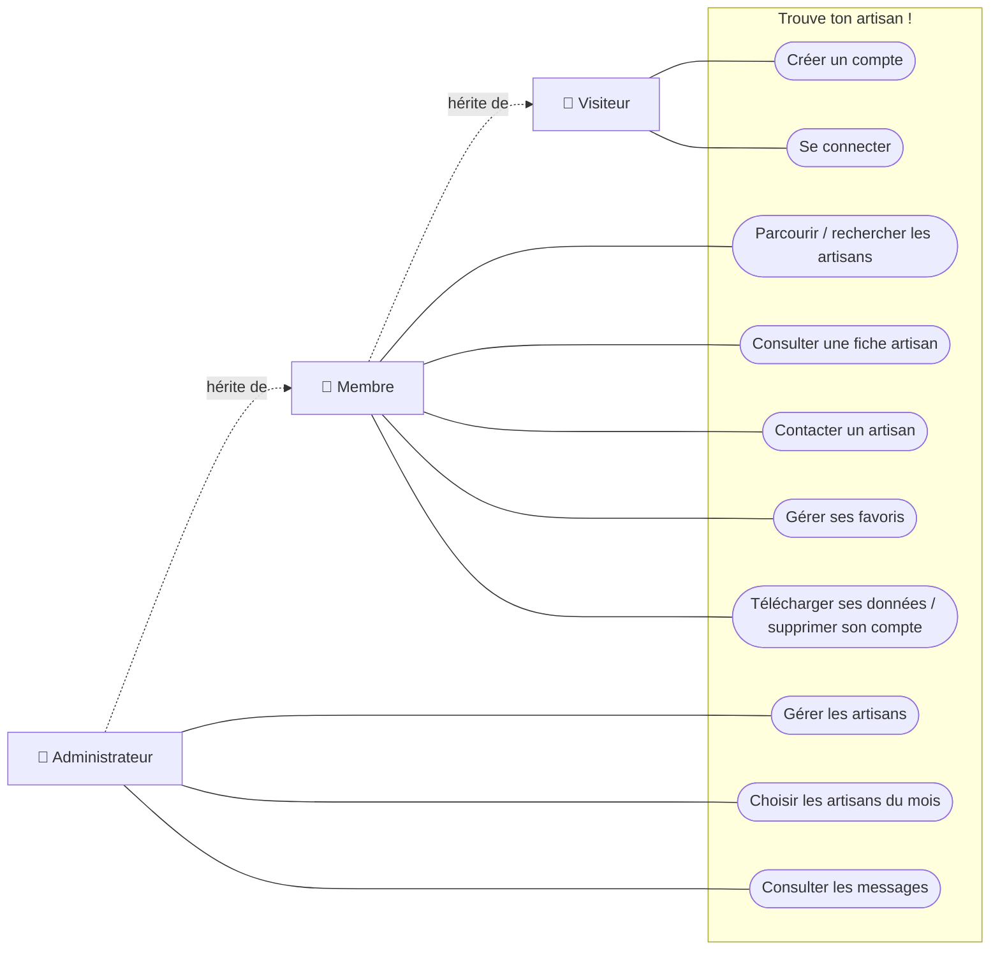
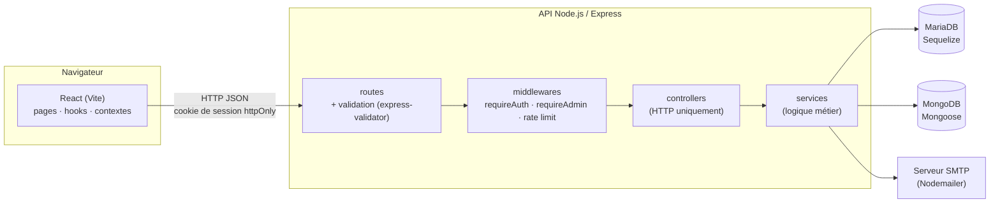
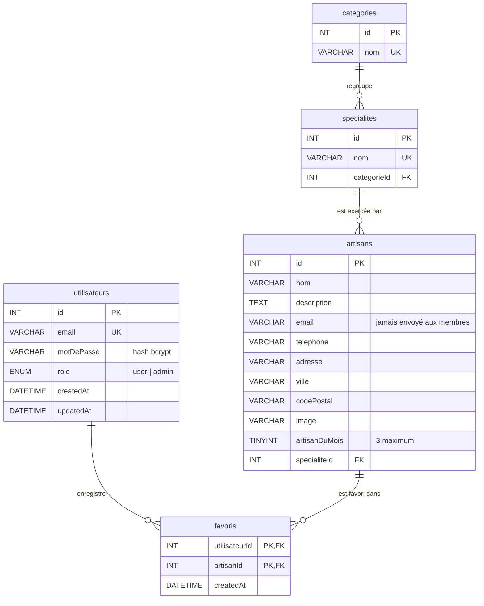
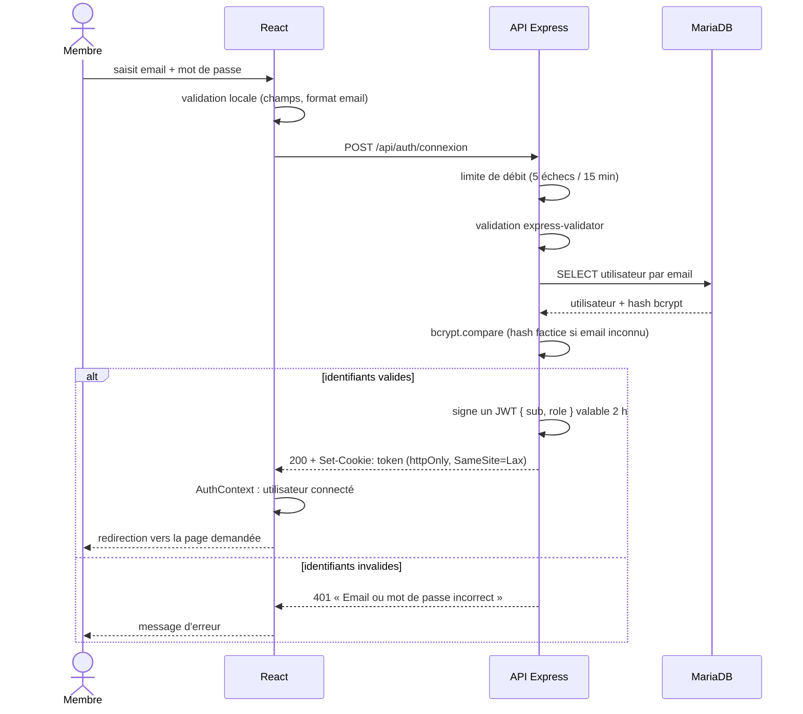
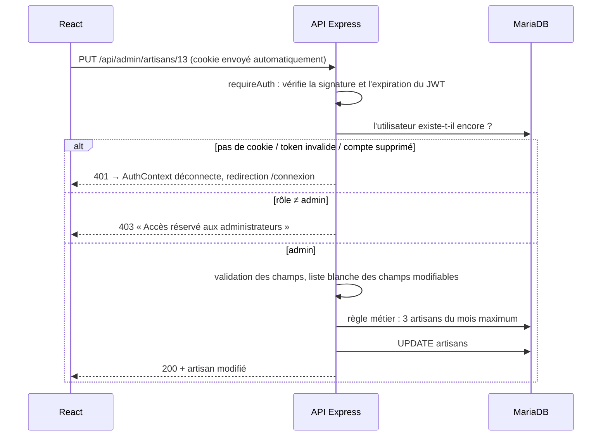
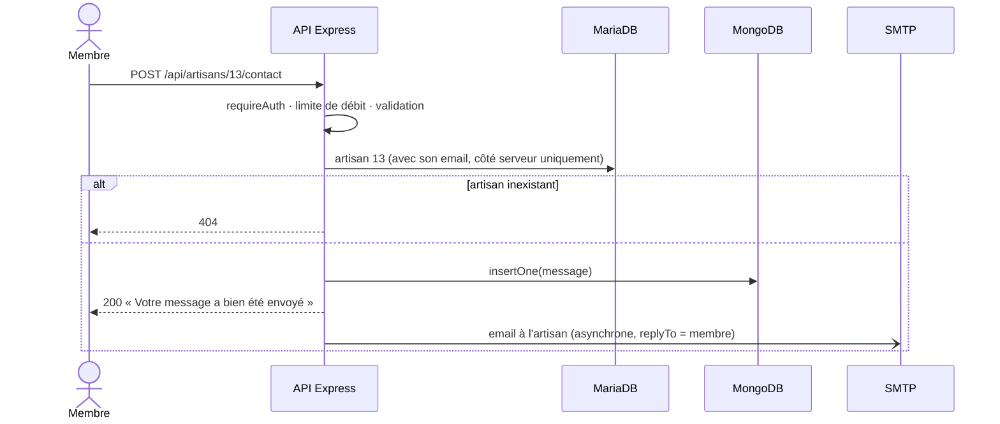

# Conception – Trouve ton artisan !

Schémas de conception du projet, établis à partir du code. Les diagrammes sont écrits en Mermaid : GitHub les affiche directement, et ils peuvent être exportés en image depuis [mermaid.live](https://mermaid.live).

## 1. Acteurs et cas d'utilisation

| Acteur | Cas d'utilisation |
|---|---|
| **Visiteur** | Consulter l'accueil · Créer un compte · Se connecter · Lire les pages légales |
| **Membre** (hérite du visiteur) | Parcourir les artisans par catégorie · Rechercher un artisan par nom · Consulter une fiche · Contacter un artisan · Gérer ses favoris · Télécharger ses données · Supprimer son compte · Se déconnecter |
| **Administrateur** (hérite du membre) | Ajouter / modifier / supprimer un artisan · Désigner les artisans du mois (3 max.) · Consulter les messages · Marquer un message lu / non lu · Supprimer un message |



## 2. Architecture



## 3. Base relationnelle (MariaDB)

### MCD (Merise)

| Association | Entités | Cardinalités |
|---|---|---|
| **APPARTENIR** | SPÉCIALITÉ – CATÉGORIE | une spécialité appartient à **1,1** catégorie ; une catégorie regroupe **0,n** spécialités |
| **EXERCER** | ARTISAN – SPÉCIALITÉ | un artisan exerce **1,1** spécialité ; une spécialité est exercée par **0,n** artisans |
| **FAVORISER** | UTILISATEUR – ARTISAN | un utilisateur a **0,n** artisans favoris ; un artisan est favori de **0,n** utilisateurs (porte la date d'ajout) |

### MLD / MPD

`favoris` est la table issue de l'association **FAVORISER** (n,n) : sa clé primaire est composée des deux clés étrangères.



Toutes les clés étrangères sont en `ON DELETE CASCADE` : supprimer un artisan ou un compte supprime les favoris correspondants.

## 4. Base NoSQL (MongoDB)

Collection `messages` : un document par message de contact.

```json
{
  "_id": "ObjectId",
  "artisan": { "id": 13, "nom": "Maçonnerie Dupont" },
  "utilisateurId": 2,
  "nom": "Jean Martin",
  "email": "jean.martin@exemple.fr",
  "objet": "Demande de devis",
  "message": "Bonjour, ...",
  "lu": false,
  "createdAt": "2026-10-02T09:15:00.000Z",
  "updatedAt": "2026-10-02T09:15:00.000Z"
}
```

| Index | Rôle |
|---|---|
| `artisan.id` | retrouver les messages d'un artisan |
| `createdAt` (TTL 365 jours) | suppression automatique après 12 mois (RGPD) |

**Pourquoi MongoDB pour les messages ?** Un message est un document autonome : écrit une fois, lu par l'administrateur, sans jointure. Le nom de l'artisan y est recopié (dénormalisation) pour que le message reste lisible même si l'artisan est supprimé de la base SQL. Les données reliées entre elles (catégories, spécialités, artisans, comptes, favoris) restent en relationnel, où les clés étrangères garantissent leur cohérence.

## 5. Séquence : connexion



## 6. Séquence : accès à une route protégée (admin)



## 7. Séquence : message de contact (SQL + NoSQL)


